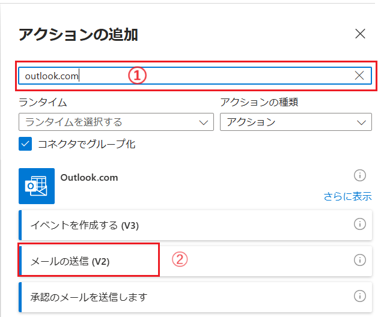

# JSON データに応答を返すLogic Apps の作成

この手順では、クライアントから HTTP POST メソッドで送信された JSON データを解析し、その内容をメールとして送信、同時に受信したデータを JSON としてレスポンスする Logic Apps を作成します。

具体的な手順は以下の通りです。

1. Azure アカウントの資格情報で [Azure Portal](https://portal.azure.com) にサインインし、画面左上のハンバーガーメニューをクリックして、 \[+リソースの作成\] を選択します

2. **リソースの作成** 画面に遷移するので、画面左の Azure Marketplace メニューで、 \[統合\] - \[Logic Apps\] をクリックします
    

3. **ロジック アプリの作成** 画面が表示されるので、各項目を以下の通り入力し、 \[**確認および作成**\] ボタンをクリックして遷移した画面で \[**作成**\] ボタンをクリックしてデプロイを開始します

    | 項目  | 設定値 |
    |----|----|
    | サブスクリプション | *お使いのサブスクリプション*   |
    | リソースグループ   | *任意のリソースグループ* |
    | インスタンスの詳細 | *任意のユニークな名前* |
    | 場所 | `Japan East` |
    | ログの分析の有効化 | **いいえ** |
    | プラン | **消費** |
    | ゾーン冗長 | **無効** |

    

    デプロイが完了したら \[**リソースへ移動**\] ボタンをクリックします

4.  **\[概要\]** の画面に遷移するので、画面左のメニューより\[**ロジックアプリ デザイナー**\] をクリックし、画面右側の \[**トリガーの追加**\] ボタンをクリックします

    

5. 画面の右側に \[**トリガーの追加**\] ブレードが表示されるので、\[**ランタイム**\] ドロップダウン リストボックスから \[**アプリ内**\] チェックボックスを選択し、検索結果で \[**Request**\] のタイルをクリックします

    

    遷移した画面で \[**When a HTTP request is received**\] タイルをクリックします

     
    
6. トリガー **When a HTTP request is received** の設定画面が表示されるので、\[**サンプルのペイロードを使用してスキーマを生成する**\] リンクをクリックします

    
    
7. 「**サンプルの JSON ペイロードを入力するか、貼り付けます。**」と書かれたダイアログボックスが表示されるので、同ダイアログボックスのテキスト エリア部分に以下のサンプル JSON を貼り付け、\[完了\] ボタンをクリックします

    ```json
    {
        "title" : "タイトル",
        "subTitle" : "副タイトル",
        "price" : "1000",
        "text" : "本文"
    }
    ```
 
    なお、この JSON はクライアントが送信するデータの構造を表すサンプルです。

8.  **When a HTTP request is received** の設定画面の\[**Request Body JSON Schema**\] にスキーマの JSON が設定されたのを確認し、ワークフローデザイン画面の \[**When a HTTP request is received**\]ボックス下の \[**+**\] アイコンをクリックし、表示された\[**アクションの追加**\]をクリックします

    

9. 画面の右側に \[**アクションの追加**\] ブレードが表示されるので、検索ボックスに `outlook.com` と入力し、検索結果で \[**メールの送信(V2)**\] のタイルをクリックします

    

10. \[Outlook.com\] のボックス内に \[**サイン イン**\] ボタンが表示されるのでクリックし、Outlook.com で使用できる Microsoft アカウントでログインします

11. ログインが成功すると、\[**メールの送信(V2)**\] ボックスが表示されるので \[\*宛先\] にメールを送る、メールが受信したことが確認することのできる任意のメールアドレスを指定します

12. \[\*件名\] ボックスをクリックすると青色のポップアップが表示されるので、稲妻マークのアイコンをクリックします

    

    ドロップダウン リストボックスがポップアップされ、リストの中にサンプルの JSON ペイロードで指定した要素の一覧が表示されるので、\[**title**\] をクリックするか、\[\*件名\] ボックスにドラッグアンドドロップします

    

      \[\*本文\] にも同じく、ドロップダウン リストボックスより、**subTitle** と **price**, **text** をクリックして指定します

    

13. ワークフローデザイン画面の \[**メールの送信(V2)**\]ボックス下の \[**+**\] アイコンをクリックし、表示された\[**アクションの追加**\]をクリックします

    

14. s画面の右側に \[**アクションの追加**\] ブレードが表示されるので、検索ボックスに `response` と入力し、検索結果で \[**Response**\] のタイルをクリックします

    

15. \[**Response**\] の設定画面が表示されるので、\[**Body**\] ボックスに以下の内容を記述します

    ```json
    {
        "title" : "",
        "subTitle" : "",
        "price" : "",
        "text" : ""
    }
    ```

    記述した JSON の各要素の **"**(ダブルクォーテーション) の間にカーソルを移動し、青色のポップアップかから稲妻マークのアイコンをクリックします

    

16. \[**Body**\] ボックス内の JSON の各要素の値に対応する動的コンテンツの要素をクリックして設定します

    

13. 画面上部の \[保存\] メニューをクリックして、ワークフローを保存します

    

14. 再度 \[**When a HTTP request is received**\]ボックスをオープンすると、\[**HTTP URL**\] が生成されているので、コピーボタンを使用してコピーし、メモ帳などに張り付けてメモしておきます

    

ここまでの手順で、クライアントから送信された JSON データを解析し、その内容をメールとして送信、同時に受信したデータを JSON としてレスポンスする Logic Apps が作成されました。

手順 14 でコピーした URL に対して、クライアントから以下のような JSON データを POST することで、この Logic Apps を実行することができます。


```json
{
    "title" : "題名",
    "subTitle" : "副題名",
    "price" : "価格",
    "text" : "本文"
}
```

次の演習では、作成した Logic Apps の検証を行います。

<br>

---
👉 : [**作成した Logic Apps の検証**](ex02.md)へ

🏚️ :  [**README**](README.md)