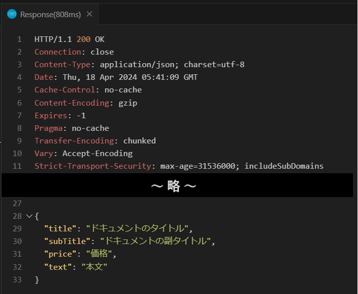

# 2. 作成した Logic Apps の検証

この手順では、[**1. JSON データに応答を返す Logic Apps の作成**](ex01.md) で作成した Logic Apps のエンドポイントにリクエストを送信し、意図したとおりの処理が行われるかを検証します。

なお、この検証では Visual Studio Code と REST Client 拡張を使用しますのであらかじめインストールしておいてください。

- [Visual Studio Code](https://code.visualstudio.com/Download) 

- [REST Client 拡張](https://marketplace.visualstudio.com/items?itemName=humao.rest-client)

作成した Logic Apps のエンドポイントにリクエストを送信して応答を確認するための具体的な手順は以下の通りです。

1. Visual Studio Code を起動します。

    画面左のツールバーの最上部にあるエクスプローラー アイコンをクリックし、表示されたブレードの \[**フォルダーを開く**\] をクリックして任意の作業フォルダーを指定します。

    

2. エクスプローラー画面で、フォルダー名の右側に表示される \[**新しいファイル**\] アイコンをクリックして、**Call-HandsonAPI.http** という名前でファイルを作成します

    

3. REST Client 拡張の動作を確認するために作成したファイル ***all-HandsonAPI.http** に以下の内容をコピーして貼り付けます。

    ```
    POST %作成した Logic Apps の URL%
    Content-type: application/json

    {
        "title" : "ドキュメントのタイトル",
        "subTitle" : "ドキュメントの副タイトル",
        "price": "価格",
        "text" : "本文"
    }
    ```

    貼り付けた内容の `%作成した Logic Apps の URL%` を、[**1. JSON データに応答を返す Logic Apps の作成**](ex01.md) の手順でメモしておいた Logic Apps のエンドポイント URL に置き換えます。

4. 記述したエンドポイントの上部の \[**Send Request**\] をクリックして API を呼び出します
    
    

    画面右側にタブが開き、API の呼び出し結果が表示されることを確認します。

    

    また、[**1. JSON データに応答を返す Logic Apps の作成**](ex01.md) のメールの送信アクションで指定したメールアドレスにメールが届いていることを確認してください。

    <br>

---
👉 : [**まとめ**](ex03.md)へ

👈 : [**JSON データに応答を返すLogic Apps の作成**](ex01.md)へ

🏚️ :  [**README**](README.md)


